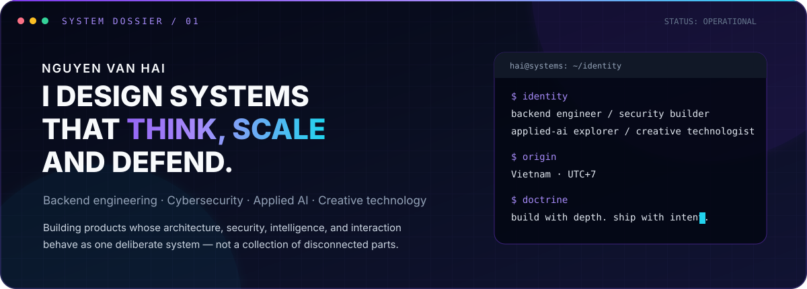
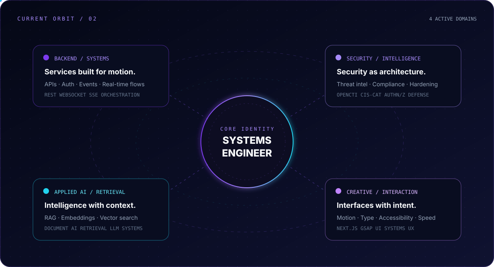
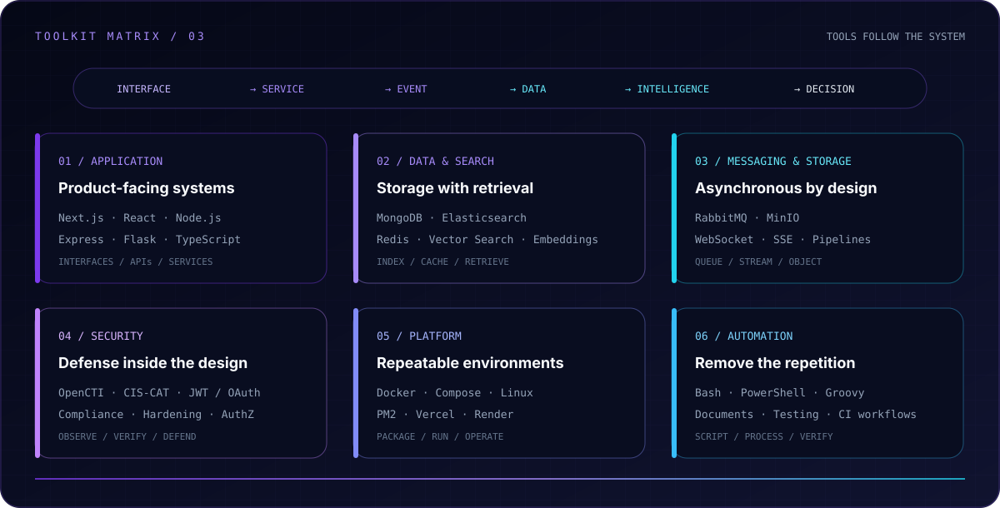
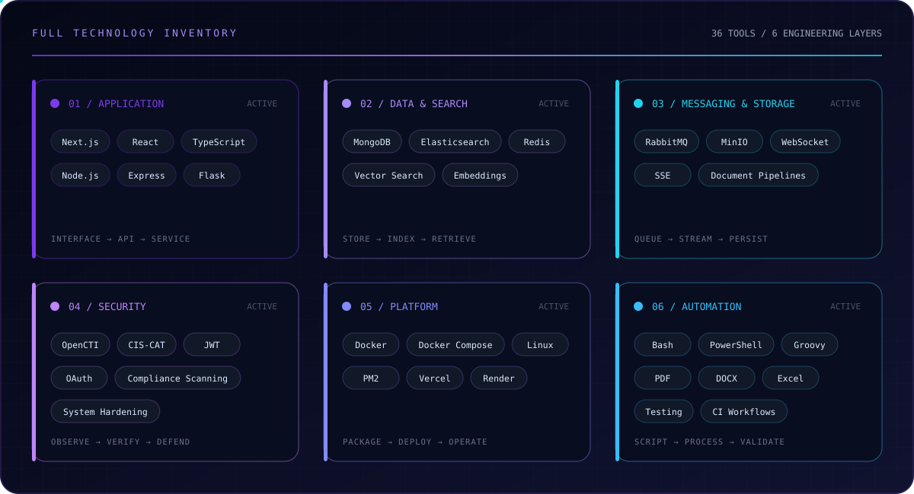
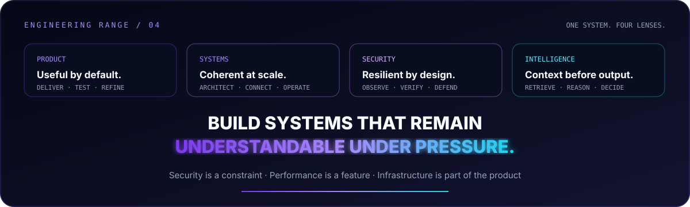

  
  
  

---

## `01 / PROFILE`

  

---

## `02 / CURRENT ORBIT`

  

---

## `03 / TOOLKIT`

  

  

---

## `04 / ENGINEERING RANGE`

  

---

## 📊 GitHub Stats

---

## 📈 Contribution Activity

---

## 📫 Connect With Me

---

### 🚀 "Building solutions, one commit at a time"

**⭐ From [undowhai113](https://github.com/undowhai113)**

